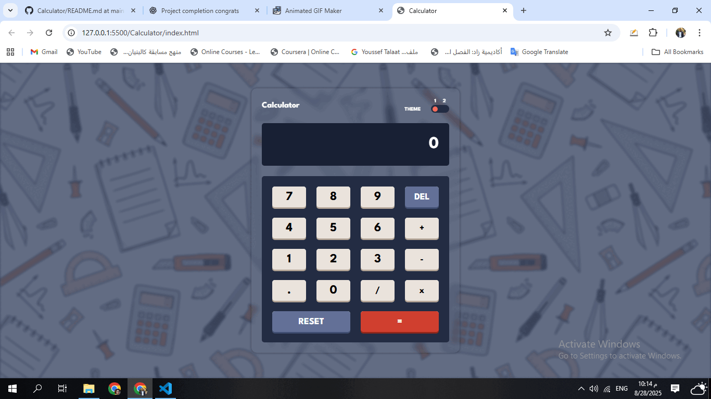

<h1 align="center">🔢 Calculator</h1>

A modern and interactive <strong>HTML</strong>, <strong>CSS</strong>, and <strong>JavaScript</strong> calculator app.  
It supports basic math operations, includes a light/dark <em>theme toggle</em>, and provides <em>keyboard support</em> for smooth user experience.

<h2>📸 Preview</h2>

  

<h2>📱 Features</h2>
<ul>
  <li>✅ Perform basic math operations (+, -, ×, ÷)</li>
  <li>✅ Light/Dark theme toggle</li>
  <li>✅ Keyboard support for numbers and operations</li>
  <li>✅ Reset and delete buttons</li>
  <li>✅ Responsive and clean UI</li>
</ul>

<h2>🛠️ Tech Stack</h2>
<ul>
  <li>🧱 HTML5 (semantic structure)</li>
  <li>🎨 CSS3 (custom styling)</li>
  <li>⚡ JavaScript (logic, keyboard, and theme toggle)</li>
</ul>

<h2>🧠 What I Practiced</h2>
<ul>
  <li>Handling user input via clicks and keyboard events</li>
  <li>Building a calculator logic with JavaScript functions</li>
  <li>Implementing a theme toggle (light/dark mode)</li>
  <li>Responsive design with CSS</li>
</ul>

<h2>🧪 How to Run</h2>
<ol>
  <li>📥 Clone or download the repository</li>
  <li>📂 Open <code>index.html</code> in your browser</li>
  <li>✅ Done! No extra setup required</li>
</ol>

<h2>💬 Contact</h2>

📧 Email: <a href="mailto:yousseftalaat142@gmail.com">yousseftalaat142@gmail.com</a>

🔗 LinkedIn: <a href="https://www.linkedin.com/in/youssef-talaat-1aa2671b3/">Youssef Talaat</a>

---

<h3 align="center">✨ Created & Maintained by <strong>Youssef Talaat</strong></h3>
